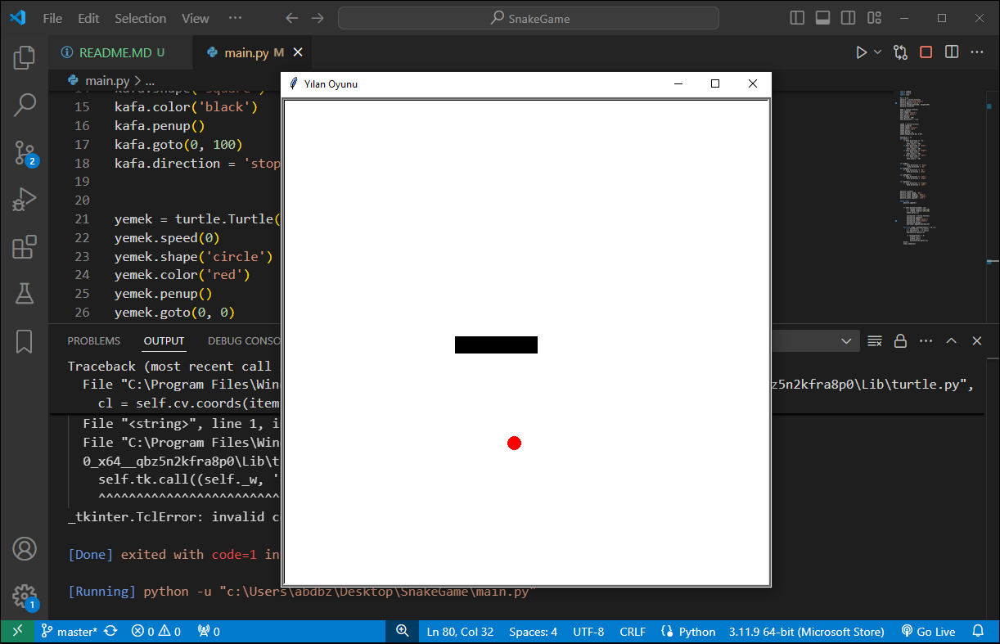

# Yılan Oyunu
🐍 Pygame kütüphanesi kullanılarak Python ile yapılmış Yılan Oyunu
## Oynanış
Klavyede yön tuşlarını kullanarak yılanı hareket ettirebilirsiniz.
## Ekran görüntüleri

## Diğer Projelerim
[WhileDöngüsüileSwitchKullanımı](http://a.com)
[WindowsFormKullanıcıKaydı](https://github.com/gryphonsft/WindowsFormKullaniciKaydi)		

